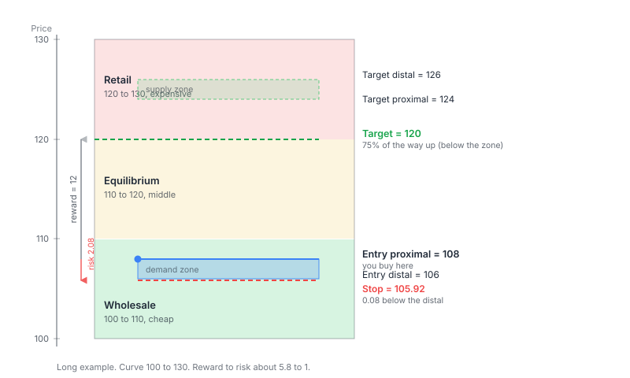

# How the calculator reads a chart

Notes on what the Trade Builder actually does with the numbers you type into the Zones step: Demand high, Demand low, Supply high, and Supply low. The example below is a long trade on a stock whose curve runs from 100 to 130, a demand zone of 106 to 108, and a supply zone of 124 to 126. It assumes the setup scored 8.5 or higher, a proximal entry, so you buy right at Demand high (108).



## Two steps

It does two things, in order. First it scores the setup out of 10 to decide whether the trade is worth taking. If the score is high enough, it then works out the real order: entry, stop, target, and how many shares. If the score says no trade, it stops there and never builds an order. In the code that is `buildTrade`, which returns early with no order when the verdict is no trade.

## The curve

You give it a price range (here 100 at the bottom, 130 at the top) and it cuts that into three equal slices:

- Wholesale, 100 to 110. The cheap third.
- Equilibrium, 110 to 120. The middle.
- Retail, 120 to 130. The expensive third.

The idea is buy cheap, sell dear. On a long you want to be buying down in wholesale. On a short it flips, you want to be selling up in retail.

## Demand high/low and supply high/low

Each zone is a box on the chart with two edges, and both are values you type in. Every edge also has an older name from the strategy's original terms, proximal and distal, which you'll see if you read Eugene's README:

- A demand zone sits below price. Its top edge, Demand high, is the one price reaches first (proximal). Its bottom edge, Demand low, is the far edge (distal) — your stop goes just past it.
- A supply zone sits above price. It's the mirror: its bottom edge, Supply low, is the near edge (proximal); its top edge, Supply high, is the far edge (distal).

This is fixed per zone, not per direction — a demand zone's near edge is always its high, a supply zone's near edge is always its low, whichever direction you're trading.

## Two zones, not one

Easy thing to miss: the four price lines come from two different boxes. The demand zone at the bottom (106 to 108) is where you buy. The supply zone at the top (124 to 126) is what you aim for.

## The Decision Matrix

Before any scoring happens, the Decision Matrix decides whether there's a trade to score at all. It looks at three things you've already given it — which zone you're entering (demand or supply), where that zone sits on the curve (wholesale, equilibrium, or retail), and the trend — and resolves one of three verdicts: trade, no-trade, or "trade, but only if the profit zone is 5:1 or better."

A demand zone always aims long; a supply zone always aims short. The matrix's job is to veto that when the setup is fighting the trend from a bad spot on the curve.

For this example: a demand zone, sitting in wholesale, in an uptrend. That's rule **r** from the README's eighteen-cell table — demand, low on the curve, uptrend — and it trades unconditionally, no profit-zone condition attached. Compare that to rule **f**, the same demand zone but in retail instead of wholesale: that one only trades if the profit zone is 5:1 or better, because buying expensive against an uptrend is a marginal setup that needs extra room to be worth it.

If the matrix vetoes the setup, that's it — no score gets built, and the order ticket just says the zone isn't a valid setup for the current trend and curve position, with the opposite direction possibly qualifying instead. That's one of three ways to end up with "no trade": the matrix veto, a score under 7, or a score that qualifies but the zones are too tight for the target to clear the entry.

## The numbers on the diagram

- Demand high 108: the near edge of the demand zone, where you buy on this long.
- Demand low 106: the far edge, the stop sits past it.
- Stop 105.92: just below Demand low.
- Supply high 126 and Supply low 124: the zone you're aiming for.
- Target 120: where you actually exit, most of the way up but before the zone.

### Why this entry scores well

108 (Demand high) sits in wholesale (100 to 110), the good side of the curve for a long, so it gets the full curve point. If the entry had been up at 122 it would be buying in retail and score nothing.

### The stop

The stop sits past Demand low by a buffer based on volatility:

```
buffer = ATR x 2% = 4 x 0.02 = 0.08
stop   = 106 - 0.08 = 105.92
```

Daily trades use 2% of ATR, weekly or longer use 10%. The gap here is tiny, so on the diagram the stop sits right up against the demand zone's low line.

Risk per share is just entry minus stop: 108 - 105.92 = 2.08.

### The target

You exit before the supply zone, because that is where sellers turn up. The target is a set percentage of the way from your entry up to the near edge of the supply zone:

```
target = Demand high + (Supply low - Demand high) x 75%
       = 108 + (124 - 108) x 75% = 108 + 12 = 120
```

### Reward against risk

```
reward = 120 - 108 = 12
reward against risk = 12 / 2.08 = about 5.8 to 1
```

Well above the 3 to 1 minimum the strategy asks for.

If it had instead scored a confirmation entry (7 to just under 8.5), you would buy 10 cents higher at 108.10. That makes risk 2.18, reward 11.90, and reward against risk about 5.5 to 1.

## Where the inputs come from

The calculator does not work out the zone lines. You read them off the chart and type them in. How you draw the zone (which candles, body or wick) is part of the trading method, not the app.

## The full scorecard

The order math above assumed the setup scored 8.5 or higher. Here's where that number actually comes from: six odds enhancers, added up out of 10.

Three are scored automatically from what you've already entered:

- **Curve — 1 point.** 108 sits in wholesale, the cheap third, and that's the good side of the curve for a long. Wholesale scores 1, equilibrium 0.5, retail 0 (mirrored for a short).
- **Trend — 2 points.** This is a long in an uptrend, trading with the trend. Uptrend scores 2, sideways 1, downtrend 0 for a long (mirrored for a short).
- **Profit zone — 2 points.** The demand zone's height (Demand high 108 - Demand low 106 = 2) divides into the distance from Demand high to Supply low (124 - 108 = 16) eight times over, well past the 5:1 needed for the full 2 points. This is the same ratio the Decision Matrix checks for the marginal cells above.

The other three are your own read of the chart, typed in as the strength, time, and freshness ratings:

- **Strength — up to 2 points.** How sharply price left the zone. Scores 2, 1, or 0. Here, a strong rejection: 2.
- **Time — up to 1 point.** How little time price spent at the zone. Scores 1, 0.5, or 0. Here, 0.5.
- **Freshness — up to 2 points.** How untouched the zone is since it formed. Scores 2, 1, or 0. Here, 1.

```
total = curve + trend + profit zone + strength + time + freshness
      = 1     + 2     + 2           + 2        + 0.5  + 1
      = 8.5
```

8.5 and up is a proximal entry — buy right at Demand high, which is the worked example above. 7 up to just under 8.5 is a confirmation entry, where you wait for price to re-cross Demand high before buying, 10 cents past it. Below 7, the strategy calls no trade regardless of what the Decision Matrix said.
